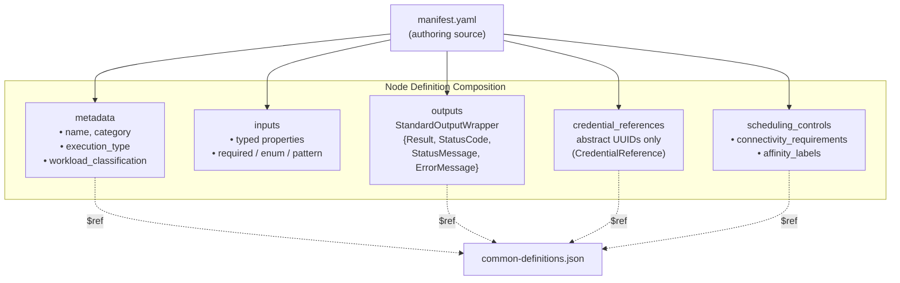
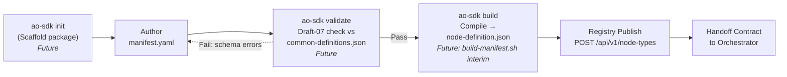
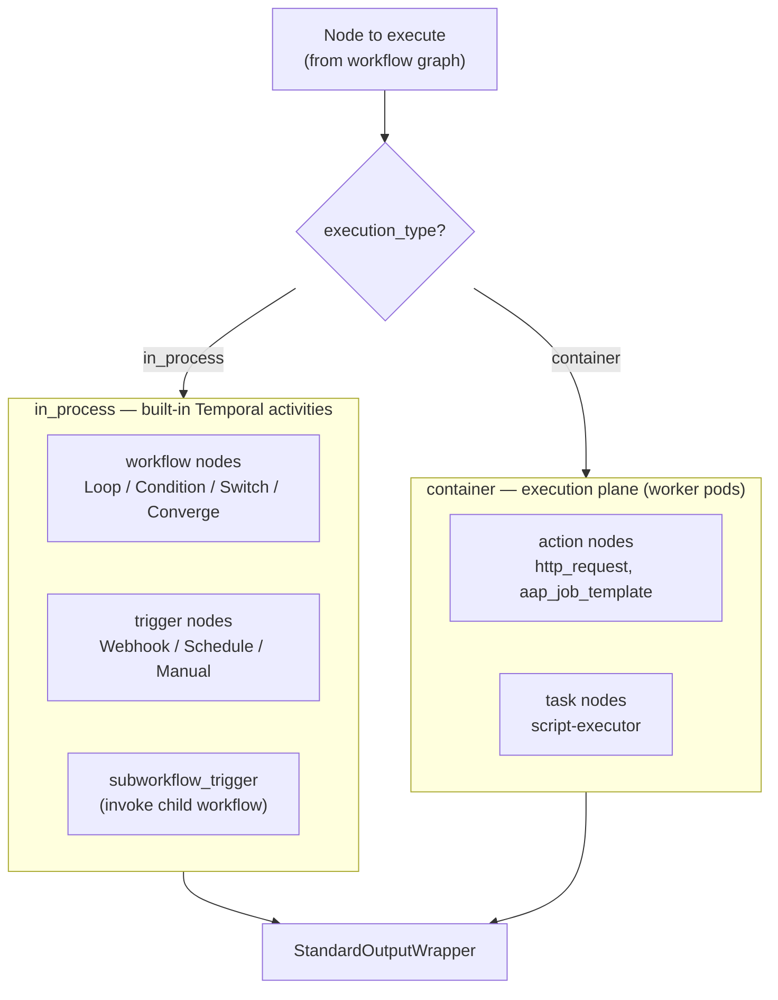
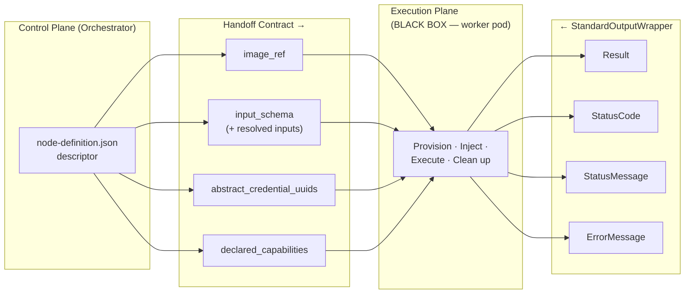
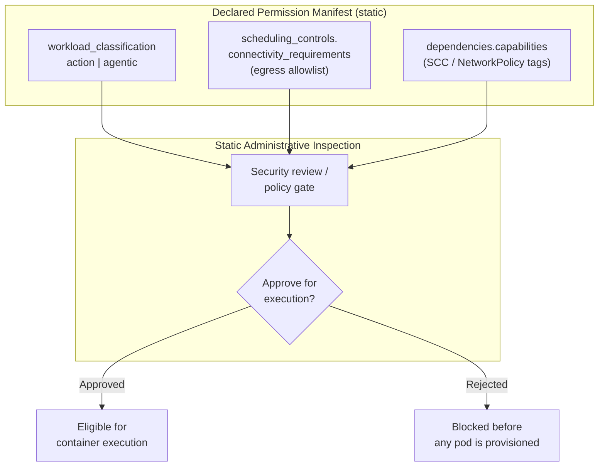

# Node SDK Architecture

Target-state specification for the Syntara Node SDK: the schema-driven framework that defines how custom automation nodes are authored, packaged, registered, and handed off to the execution plane. This document is the authoritative reference for the node taxonomy, the authoring and compilation format, the registry database and API, and the dynamic dispatch contract.

The specification deliberately **shifts left**: it centers on the *definition* of a node — what a node declares about itself — and treats the execution plane as a black box that consumes a well-defined handoff contract. Execution mechanics (pod provisioning, streaming, cleanup) are described only to the extent needed to define the contract.

## Architecture Principles

1. **YAML Authoring, JSON Registry.** Developers author `manifest.yaml` (human-friendly, supports comments). The SDK validates against JSON Schema (Draft-07) and compiles to `node-definition.json` for registry storage. The compiled artifact is the single source of truth the frontend and backend consume, enabling <500ms canvas form rendering.

2. **Four-Category Taxonomy.** Every node declares exactly one of four categories: `action`, `task`, `workflow`, `trigger`. Category, together with `execution_type`, determines routing and validation.

3. **Explicit Execution Plane.** Every node declares an `execution_type` of `in_process` or `container`. This value is the fork point for dynamic dispatch — it decides whether the node runs as a built-in Temporal activity or is handed off to an isolated worker pod.

4. **Strict Backwards Compatibility.** `StandardOutputWrapper` (`Result`, `StatusCode`, `StatusMessage`, `ErrorMessage`) is immutable. Template expressions like `${task.Result.stdout}` never break across node versions.

5. **Zero-Trust Resources.** Node definitions store only UUID references (`abstract_credential_uuids`). The orchestrator resolves them at runtime and injects via tmpfs or env vars. No raw secrets ever appear in a definition.

6. **Manifest-Declared Permissions.** Nodes declare their capabilities and connectivity in the manifest. Administrators can statically inspect and audit these `declared_capabilities` before any container executes.

## Core Architectural Standards & Taxonomy

### Node Category Taxonomy

The platform recognizes exactly four categories, defined canonically as `NodeCategory` in `common-definitions.json`:

```json
"enum": ["action", "task", "workflow", "trigger"]
```

| Category | Purpose | Typical `execution_type` | Examples |
|----------|---------|--------------------------|----------|
| `action` | Domain and external API integrations | `container` | `http_request`, `aap_job_template` |
| `task` | Atomic compute and script executors | `container` | `script-executor` (ANSTRAT-2349; Python 3.12, Bash 5.2) |
| `workflow` | In-memory control-plane logic | `in_process` | `condition`, `loop`, `switch` |
| `trigger` | Event entry points | `in_process` | Webhook, Schedule, Manual, `subworkflow_trigger` |

### Execution Type

`NodeExecutionType` (`common-definitions.json`) captures *where* a node runs:

```json
"enum": ["in_process", "container"]
```

- **`in_process`** — executed inline as a built-in Temporal activity inside the orchestrator process. Reserved for control-plane `workflow` logic and `trigger` nodes that need no isolated runtime.
- **`container`** — dispatched to an isolated worker pod (the execution plane). Reserved for `action` and `task` nodes that run user or integration code under strict resource and network isolation.

### The `subworkflow_trigger` Node

`subworkflow_trigger` is a dedicated, first-class node type that lets a parent workflow invoke a child workflow as a composable, reusable unit.

- **Category:** `trigger`
- **Execution type:** `in_process`
- **Reference implementation:** [examples/subworkflow-trigger/](examples/subworkflow-trigger/)

It runs in-process as a built-in Temporal activity: it accepts the **parent workflow context**, an **ingress payload schema** (the parent↔child contract), and the **caller execution ID**, then hands control to the referenced child workflow. It returns a `StandardOutputWrapper` whose `Result` carries the child workflow's terminal output, so downstream parent nodes can reference it via stable template expressions (e.g., `${call_child.Result.summary}`). The orchestrator tracks invocation `depth` to bound recursion.

### `manifest.yaml` — The Developer Authoring Format

Developers author a single `manifest.yaml`. It is:

- **Human-friendly** — supports comments and multi-line strings.
- **Validated** — checked against JSON Schema (Draft-07) referencing `common-definitions.json`.
- **Compiled** — `ao-sdk build` produces `node-definition.json`, the artifact stored in the registry and served to the canvas.

The compiled `node-definition.json` — not the source `manifest.yaml` — is what the registry persists and what the React canvas loads to render input forms in under 500ms.

**Standard Package Layout:**
```
my-custom-node/
├── manifest.yaml              # Primary authoring manifest (YAML, source of truth for authoring)
├── main.py                    # Imperative execution code (or main.sh for Bash)
├── requirements.txt           # Python dependencies (optional)
├── README.md                  # Node documentation
└── tests/
    └── test_main.py           # Unit tests
```

### Diagram 1 — Node Definition Composition (`manifest.yaml`)

Structural breakdown of what a `manifest.yaml` composes. This is the "what" of a node — its declared shape, independent of how it runs.



### Diagram 2 — SDK Authoring & Packaging Lifecycle

The developer lifecycle from scaffold to registry handoff. Every stage operates on the *definition*; the orchestrator only appears at the end, receiving a contract.

**Note:** `ao-sdk` CLI is a future tool. Current workflow uses `build-manifest.sh` for YAML → JSON compilation.



## Database Schema & Registry API

The registry persists compiled node definitions in PostgreSQL and exposes them through a versioned REST API.

### `node_types` Table (DDL)

```sql
CREATE TABLE node_types (
    id             UUID PRIMARY KEY DEFAULT gen_random_uuid(),
    name           TEXT NOT NULL,
    category       TEXT NOT NULL
                     CHECK (category IN ('action', 'task', 'workflow', 'trigger')),
    execution_type TEXT NOT NULL
                     CHECK (execution_type IN ('in_process', 'container')),
    descriptor     JSONB NOT NULL,          -- compiled node-definition.json
    image_ref      TEXT,                     -- container image (NULL for in_process nodes)
    version        TEXT NOT NULL DEFAULT '1.0.0',
    enabled        BOOLEAN NOT NULL DEFAULT TRUE,
    created_at     TIMESTAMPTZ NOT NULL DEFAULT now(),
    updated_at     TIMESTAMPTZ NOT NULL DEFAULT now(),
    UNIQUE (name, version)
);

-- Container-backed nodes must declare an image; in_process nodes must not.
ALTER TABLE node_types ADD CONSTRAINT node_types_image_ref_by_execution_type
    CHECK (
        (execution_type = 'container'  AND image_ref IS NOT NULL) OR
        (execution_type = 'in_process' AND image_ref IS NULL)
    );

-- GIN index for querying declared capabilities / connectivity inside the descriptor.
CREATE INDEX idx_node_types_descriptor ON node_types USING GIN (descriptor);
CREATE INDEX idx_node_types_category   ON node_types (category);
CREATE INDEX idx_node_types_enabled    ON node_types (enabled);
```

### `NodeTypeDescriptor` (SQLModel / Pydantic)

Per project standards, a single SQLModel class serves as both the database table and the API schema.

```python
from datetime import datetime
from enum import StrEnum
from typing import Any
from uuid import UUID, uuid4

from sqlalchemy import CheckConstraint, UniqueConstraint
from sqlalchemy.dialects.postgresql import JSONB
from sqlmodel import Column, Field, SQLModel


class NodeCategory(StrEnum):
    ACTION = "action"
    TASK = "task"
    WORKFLOW = "workflow"
    TRIGGER = "trigger"


class NodeExecutionType(StrEnum):
    IN_PROCESS = "in_process"
    CONTAINER = "container"


class NodeTypeDescriptor(SQLModel, table=True):
    """Registry record for a single compiled node definition.

    `descriptor` holds the compiled node-definition.json produced by
    `ao-sdk build`; it is the contract the orchestrator hands to the
    execution plane. `image_ref` is required for container nodes and
    forbidden for in_process nodes (enforced by a table CHECK constraint).
    """

    __tablename__ = "node_types"
    __table_args__ = (
        UniqueConstraint("name", "version", name="uq_node_types_name_version"),
        CheckConstraint(
            "(execution_type = 'container' AND image_ref IS NOT NULL) OR "
            "(execution_type = 'in_process' AND image_ref IS NULL)",
            name="node_types_image_ref_by_execution_type",
        ),
    )

    id: UUID = Field(default_factory=uuid4, primary_key=True)
    name: str = Field(index=True)
    category: NodeCategory = Field(index=True)
    execution_type: NodeExecutionType
    descriptor: dict[str, Any] = Field(sa_column=Column(JSONB, nullable=False))
    image_ref: str | None = Field(default=None)
    version: str = Field(default="1.0.0")
    enabled: bool = Field(default=True, index=True)
    created_at: datetime = Field(default_factory=datetime.utcnow)
    updated_at: datetime = Field(default_factory=datetime.utcnow)
```

### Registry REST API — `/api/v1/node-types`

All responses use the platform's standard envelope. Single-resource responses wrap the record; list responses include pagination metadata.

| Method | Path | Purpose |
|--------|------|---------|
| `POST` | `/api/v1/node-types` | Register (publish) a compiled node definition |
| `GET` | `/api/v1/node-types` | List registered node types (filter by `category`, `execution_type`, `enabled`; `?view=palette` for the visual-builder drawer) |
| `GET` | `/api/v1/node-types/{id}` | Fetch a single node type record (the path also accepts a node `name`, resolving to the latest version) |
| `GET` | `/api/v1/node-types/{id}/descriptor` | Fetch the raw compiled `node-definition.json` (unwrapped) for canvas form rendering |
| `PATCH` | `/api/v1/node-types/{id}` | Update mutable fields (`enabled`, `image_ref`, `descriptor` for a new version) |
| `DELETE` | `/api/v1/node-types/{id}` | Remove a node type from the registry |

**`POST /api/v1/node-types`** — request body is the compiled `node-definition.json` plus registry metadata:

```json
{
  "name": "script_executor",
  "category": "task",
  "execution_type": "container",
  "image_ref": "registry.syntara.io/nodes/script-executor:1.0.0",
  "version": "1.0.0",
  "descriptor": { "...": "compiled node-definition.json" }
}
```

Response `201 Created`:

```json
{
  "data": {
    "id": "550e8400-e29b-41d4-a716-446655440000",
    "name": "script_executor",
    "category": "task",
    "execution_type": "container",
    "image_ref": "registry.syntara.io/nodes/script-executor:1.0.0",
    "version": "1.0.0",
    "enabled": true,
    "descriptor": { "...": "compiled node-definition.json" },
    "created_at": "2026-09-09T12:00:00Z",
    "updated_at": "2026-09-09T12:00:00Z"
  }
}
```

**`GET /api/v1/node-types?category=task&enabled=true`** — list envelope:

```json
{
  "data": [
    { "id": "550e8400-...", "name": "script_executor", "category": "task", "execution_type": "container", "enabled": true }
  ],
  "meta": { "total": 1, "limit": 50, "offset": 0 }
}
```

**`PATCH /api/v1/node-types/{id}`** — partial update; returns the updated record in the `data` envelope:

```json
{ "enabled": false }
```

**`DELETE /api/v1/node-types/{id}`** — returns `204 No Content` on success, `404` if the id is unknown.

#### Visual-builder views

The React Flow visual builder consumes two projections of the registry, served by
the same endpoints above so the canvas needs no bespoke API:

**`GET /api/v1/node-types?view=palette`** — the drag-and-drop node drawer summary,
one entry per node (latest enabled version), in the frontend's camelCase shape.
`icon` is the optional [`NodePaletteIcon`](common-definitions.json) authored in the
manifest and carried through compilation, falling back to a per-category default:

```json
{
  "data": [
    {
      "name": "http_request",
      "displayName": "HTTP Request",
      "category": "action",
      "executionType": "container",
      "version": "1.0.0",
      "description": "Non-blocking HTTP/HTTPS API orchestrator with credential injection, response parsing, and automatic retry logic.",
      "icon": "globe"
    }
  ],
  "meta": { "total": 1, "limit": 50, "offset": 0 }
}
```

**`GET /api/v1/node-types/{id}/descriptor`** — returns the compiled
`node-definition.json` **verbatim and unwrapped** (the one deliberate exception to
the standard envelope). The canvas renders input forms, default values, field
groupings, and port bindings directly from this document, so new node types appear
in the builder with no frontend deployment. The path also accepts a node `name`
(e.g. `/api/v1/node-types/http_request/descriptor`) as the UI-facing alias for the
node's latest version.

A runnable reference implementation of these endpoints (register → persist to a
PostgreSQL JSONB column → advertise) lives in
[`examples/http-request/test_postgres_registry.py`](examples/http-request/test_postgres_registry.py).

## Dynamic Dispatch Logic (`dynamic_workflow.py`)

The orchestrator's workflow engine forks execution on a node's `execution_type`. This fork is the boundary between the control plane and the execution plane.



- **`in_process` branch** — the engine dispatches the node as a built-in Temporal activity within the orchestrator process. This path serves control-plane `workflow` logic and `trigger` nodes, including `subworkflow_trigger`, which starts a child workflow and awaits its terminal output.
- **`container` branch** — the engine resolves credentials and connectivity, then hands the node's descriptor to the execution plane, which provisions an isolated worker pod. This path serves `action` and `task` nodes.

Both branches return the identical `StandardOutputWrapper` envelope, so downstream nodes are agnostic to where a node ran.

### Diagram 3 — Execution Plane Handoff Contract

The exact contract the control plane hands to the execution plane for a `container` node, and the envelope that returns. The execution plane details are intentionally ignored: this diagram fixes only the inputs and outputs at its boundary.



### Diagram 4 — Declared Capabilities & Permission Manifest

Static administrative inspection. Before any container runs, an administrator (or an automated policy gate) can audit exactly what a node is permitted to do, purely from its declared manifest.



Key inspection points, all resolvable without executing the node:

- **`workload_classification`** (`action` | `agentic`) — gates which credential classes the node may access; `agentic` nodes are blocked from infrastructure credentials.
- **`connectivity_requirements`** — the declared egress allowlist, from which the orchestrator compiles a restrictive NetworkPolicy.
- **`declared_capabilities`** — SCC / NetworkPolicy tags (e.g., `network-egress`, `script-execution`) validated against cluster policy.

## Policy & Security Enforcement

This section defines how the platform reconciles what a node *wants* with what an environment *allows*, and where each responsibility lives. It reflects the consensus reached during design review.

### The Three-Party Enforcement Model

1. **The node declares what it needs.** Every requirement a node has — credentials, filesystem access, network egress, elevated capabilities, resource ceilings — is stated declaratively in `manifest.yaml`. Collectively these fields form the node's **declared requirements**: `credential_references`, `scheduling_controls` (`connectivity_requirements`, `affinity_labels`), `dependencies.capabilities`, `metadata.workload_classification`, and `resource_requirements`. Nothing a node needs at runtime may be acquired implicitly; if it is not declared, it is denied.

2. **The environment declares what it permits.** Each deployment environment carries its own policy: which capability tags are grantable, which egress destinations are reachable, which credential classes are available, and which resource ceilings apply. This policy is owned by administrators and is independent of any individual node.

3. **The Execution Plane enforces isolation at runtime.** The Execution Plane consumes the intersection of (1) and (2) and compiles it into concrete runtime controls — Kubernetes/OpenShift **NetworkPolicies** (from `connectivity_requirements`), **Security Context Constraints** (from `dependencies.capabilities`), tmpfs credential mounts, and resource limits — then provisions the isolated worker pod under those controls. The control plane never enforces isolation itself; it only resolves and hands off the contract.

**Core design principle:** the responsibility split is fixed and non-negotiable:

1. **Nodes declare requirements** in `manifest.yaml` — the collective **declared requirements** surface (`declaredRequirements` / `scheduling_controls`, plus `credential_references`, `dependencies.capabilities`, and `metadata.workload_classification`). If it is not declared, it is not granted.
2. **Environments declare allowances** — administrator-owned policy guardrails stating which capabilities, egress destinations, credential classes, and resource ceilings are permitted in that deployment.
3. **The Execution Plane (ANSTRAT-1803) enforces isolation** at runtime, compiling the intersection of the two into concrete OpenShift pod configurations, volume mounts, and NetworkPolicies.

Declaration and enforcement are deliberately separated so that every requirement is statically auditable (see [Diagram 4](#diagram-4--declared-capabilities--permission-manifest)) before any pod is ever provisioned.

### Schema Research Benchmark: the External `ansible-playbook` Parameter Model

During SDK design research we used the external `ansible-playbook` parameter model as a worst-case expressiveness benchmark, because it declares an unusually rich requirement surface in a single interface. We mapped each of its declarative concepts onto our own manifest constructs to confirm the SDK could represent them:

| External `ansible-playbook` concept (studied) | How our `manifest.yaml` would express it |
|---|---|
| `extra_vars` (typed run parameters) | `inputs.properties` (typed, with `required` / `enum` / `pattern`) |
| Inventory / target hosts | `inputs.properties` values plus declared egress in `scheduling_controls.connectivity_requirements` |
| SSH keys, vault passwords (multiple heterogeneous secrets) | multiple `credential_references` (`CredentialReference`), resolved to `tmpfs` at runtime — never in the manifest |
| Target host networking (multi-hop egress) | `scheduling_controls.connectivity_requirements` compiled to a NetworkPolicy allowlist |
| Module privileges (e.g. file writes) | `dependencies.capabilities` (`file-write`, `script-execution`, …) realized as SCCs |

The conclusion of that research: our `manifest.yaml` schema is expressive enough to model even this dense external parameter structure without extension. 

**Our actual task-node benchmark — `script-executor` (ANSTRAT-2349).** For the real security and policy discussion below we anchor on `script-executor`, the platform's actual `task` node for isolated container execution. It runs deterministic Python 3.12 / Bash 5.2 in an isolated worker pod under the declare-then-enforce model, with a bounded requirement surface (typically `script-execution` capability and a small egress allowlist). Where the external `ansible-playbook` schema was a research stress test of *schema expressiveness*, `script-executor` is the concrete node whose *runtime enforcement* the model must serve.

### Consolidated Resource & Credential Handling

**No plaintext secrets, ever.** No raw API key, password, token, or secret material is stored in a node definition (`manifest.yaml` or the compiled `node-definition.json`) or passed through the control-plane scheduler. Nodes reference credentials exclusively through abstract UUID references (`CredentialReference`). At dispatch time the Execution Plane resolves the `credential_id`, decrypts the vault entry, and injects it directly into worker-pod memory / tmpfs (`credential_mount_type: env | file`). File mounts are RAM-backed and deleted on container exit. Error diagnostics (`ErrorMessage`) are scrubbed of credentials before persistence.

**Runtime classification taxonomy (`execution_type`).** The `execution_type` field decides *where* a node runs and, by extension, its isolation posture:

| `execution_type` | Runs as | Node categories | Pod overhead | Examples |
|---|---|---|---|---|
| `in_process` | Temporal activities directly inside the control plane | `workflow`, `trigger` | None | `subworkflow_trigger`, `condition`, `loop`, `switch` |
| `container` | Isolated OCI worker pods on the Execution Plane | `action`, `task` | One pod per execution | `http_request`, `aap_job_template`, `script-executor` |

`in_process` nodes are trusted control-plane logic with zero pod overhead; they perform no user or integration I/O and therefore need no sandbox. `container` nodes run user or integration code and are always sandboxed.

**Security classification (`workload_classification`).** Orthogonal to *where* a node runs is *what class of credentials it may request*:

- **`action`** — scripted, deterministic execution. May request infrastructure credentials (SSH, cloud API keys, vault access).
- **`agentic`** — LLM-driven, non-deterministic execution. **Restricted from requesting high-privilege infrastructure credentials.** This containment is deliberate: it prevents a prompt-injection attack against an AI agent node from escalating into infrastructure compromise. `agentic` nodes are still eligible for scoped, lower-privilege credentials as permitted by the environment.

## Scope & System Ownership Matrix

The consensus below fixes the boundaries of this initiative's **SDK & Contracts scope** so that downstream implementation teams have unambiguous handoff points. This document (and the artifacts it specifies) is authoritative for the SDK & Contracts scope only; the other two scopes are owned elsewhere and are described here solely to define the boundary.

| Scope | Owns | Explicitly out of scope for this doc |
|---|---|---|
| **SDK & Contracts** (ANSTRAT-2422) | Draft-07 platform meta-schema (`common-definitions.json`); authoring manifest spec (`manifest.yaml`); compiled DB descriptor contract (`node-definition.json`); database DDL and REST API *specifications*; reference package prototypes under `schemas/examples/` | Backend implementation; runtime enforcement |
| **Core Backend Implementation** (unknown scope) | Official Alembic migrations for `node_types`; `/api/v1/node-types` FastAPI routers; the two-tier `NodeTypeRegistry` L1/L2 Redis cache; updating `dynamic_workflow.py` for dynamic DB dispatch | Schema/contract authorship (consumes this doc); pod sandboxing |
| **Execution Plane** (ANSTRAT-1803) | Pod sandboxing; OpenShift worker container orchestration; runtime NetworkPolicy / SCC enforcement compiled from declared requirements | Contract shape (consumes the handoff contract); registry storage |

The DDL, `NodeTypeDescriptor` SQLModel, and REST API tables earlier in this document are **specifications** produced by the SDK & Contracts scope. Turning them into shipped Alembic migrations and live FastAPI routers is Core Backend Implementation work; compiling declared requirements into live cluster policy is Execution Plane work.

## Schema Reference

### Platform Meta-Schema

The schema files under `syntara/schemas/` implement the standards above. The platform maintains a **single meta-schema** that defines shared types, enums, and validation rules:

| File | Role |
|------|------|
| `common-definitions.json` | **Sole platform meta-schema** — defines `NodeCategory`, `NodeExecutionType`, `WorkloadClassification`, `StandardOutputWrapper`, `CredentialReference`, `ResourceRequirements`, `SchedulingControls`, and `DependencyDeclaration` |

Individual node schemas are **not** maintained as separate `.schema.json` files. Instead:

1. **Developers author** `manifest.yaml` instances (e.g., `script_executor/manifest.yaml`, `http_request/manifest.yaml`, `subworkflow_trigger/manifest.yaml`)
2. **The SDK compiles** each manifest into a `node-definition.json` build artifact via `ao-sdk build`
3. **The registry persists** the compiled `node-definition.json` in the `node_types.descriptor` JSONB column
4. **The orchestrator and canvas consume** the compiled artifact, not the source manifest

`common-definitions.json` is the authoritative source for shared platform types. All `manifest.yaml` instances reference these definitions via `$ref` during validation; after compilation, the resulting `node-definition.json` inherits these constraints.

### Key Common Definitions

| Definition | Purpose | Shape |
|---|---|---|
| `NodeCategory` | Four-category taxonomy | `enum: ["action", "task", "workflow", "trigger"]` |
| `NodeExecutionType` | Execution plane fork | `enum: ["in_process", "container"]` |
| `WorkloadClassification` | Credential access control | `enum: ["action", "agentic"]` |
| `StandardOutputWrapper` | Immutable output contract | `{Result, StatusCode, StatusMessage, ErrorMessage}` |
| `CredentialReference` | UUID-based credential reference | `{credential_id, credential_mount_type, credential_mount_path}` |
| `ResourceRequirements` | Kubernetes resource limits | `{limits: {cpu, memory}, requests: {cpu, memory}}` |
| `SchedulingControls` | Egress allowlist + affinity | `{connectivity_requirements, affinity_labels}` |
| `DependencyDeclaration` | Version + capability constraints | `{platformVersion, capabilities, collections, extensions}` |

### Compiled Definition Shape

Every compiled `node-definition.json` declares, at minimum:

```json
{
  "nodeType": "script_executor",
  "category": "task",
  "execution_type": "container",
  "inputs": { "...": "typed properties" },
  "outputs": { "$ref": "common-definitions.json#/definitions/StandardOutputWrapper" }
}
```

`nodeType`, `category`, `execution_type`, `inputs`, and `outputs` are required on all compiled node definitions. The `category` and `execution_type` pairing determines node behavior:
- **`script_executor`** manifest declares `category: task` + `execution_type: container`
- **`http_request`** manifest declares `category: action` + `execution_type: container`  
- **`subworkflow_trigger`** manifest declares `category: trigger` + `execution_type: in_process`

These pairings are validated during `ao-sdk validate` and enforced by the registry's table constraints.

## Open Questions & Architectural Roadmap

The following are active, unresolved questions.


- **Backend changes needed.** The following changes are currently expected as part of the SDK structure. We need to determine what is possible, feasible, and within the scope of ANSTRAT-2422 to require, implement, or pass to a separate feature.
  - **Database Migration (Alembic):**
   - **Task:** Create the official Alembic migration script in `syntara-backend` to instantiate the `node_types` table, `JSONB` descriptor column, `image_ref` `CHECK` constraint, and `GIN` index.
   - **Ownership:** Core Backend Team.

  - **Registry REST API (`/api/v1/node-types`):**
   - **Task:** Implement the FastAPI router endpoints (`POST` for node publishing/registration, `GET` for fetching compiled `node-definition.json` descriptors for sub-500ms React Flow canvas rendering).
   - **Ownership:** Core Backend / Control Plane Team.

  - **Two-Tier Registry Caching (`NodeTypeRegistry`):**
   - **Task:** Implement the L1 (in-memory) and L2 (Redis) caching layer to resolve node definitions at workflow execution time without hitting PostgreSQL on every step.
   - **Ownership:** Core Backend Team.

  - **Dynamic Dispatcher Integration (`dynamic_workflow.py`):**
   - **Task:** Update `dynamic_workflow.py` and `WorkflowValidator` to query the database/Redis registry dynamically instead of checking hardcoded Python enums.
   - **Ownership:** Core Backend Engine Team.


- **Permission degradation strategy.** When an environment denies a requirement a node has declared, what is the correct AppOps behavior? Options range from hard-fail-at-deploy to fine-grained graceful degradation (e.g., disabling only the affected capability while running the rest of the node). A degradation policy needs to be defined per capability class rather than globally.
- **Multi-tenant credential scoping for sub-workflow callers.** When a `subworkflow_trigger` invokes a child workflow across tenant or ownership boundaries, whose credential scope applies — the caller's, the callee's, or an explicitly narrowed intersection? The parent↔child ingress contract does not yet model credential-scope inheritance.
- **Dynamic rate-limiting and egress throttling per node type.** `connectivity_requirements` currently expresses *which* destinations are reachable but not *how much* traffic is permitted. Per-node-type rate limiting and egress throttling (e.g., requests/sec or bytes/sec ceilings compiled alongside the NetworkPolicy) are candidates for a future revision of `scheduling_controls`.
