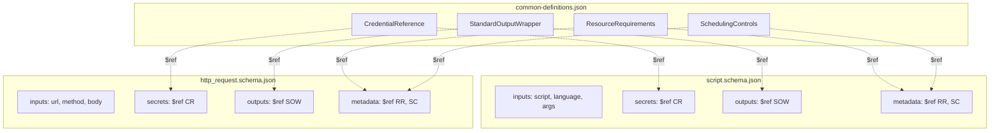
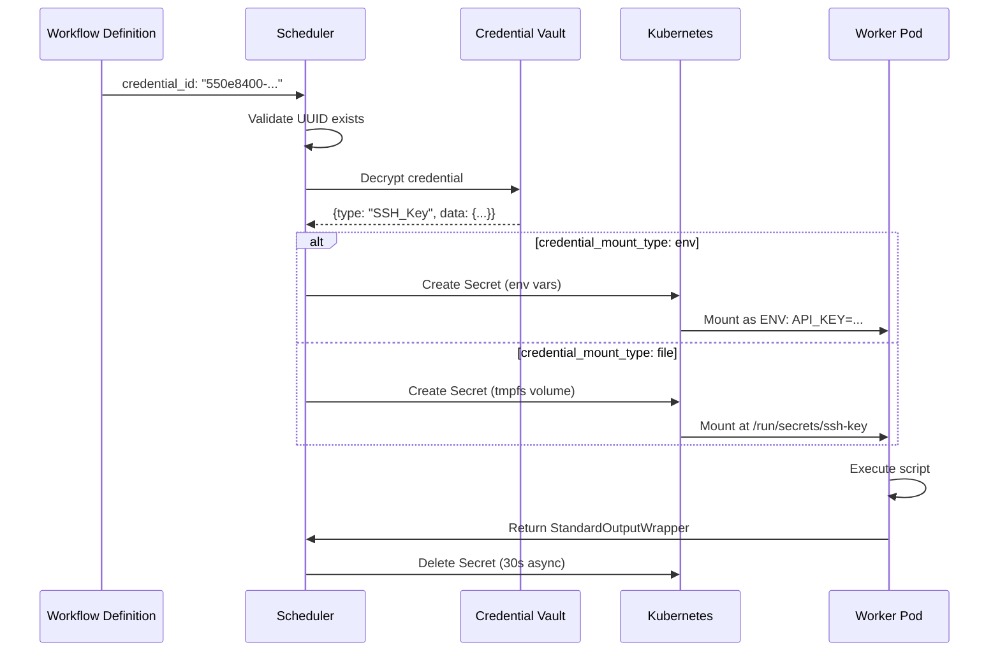
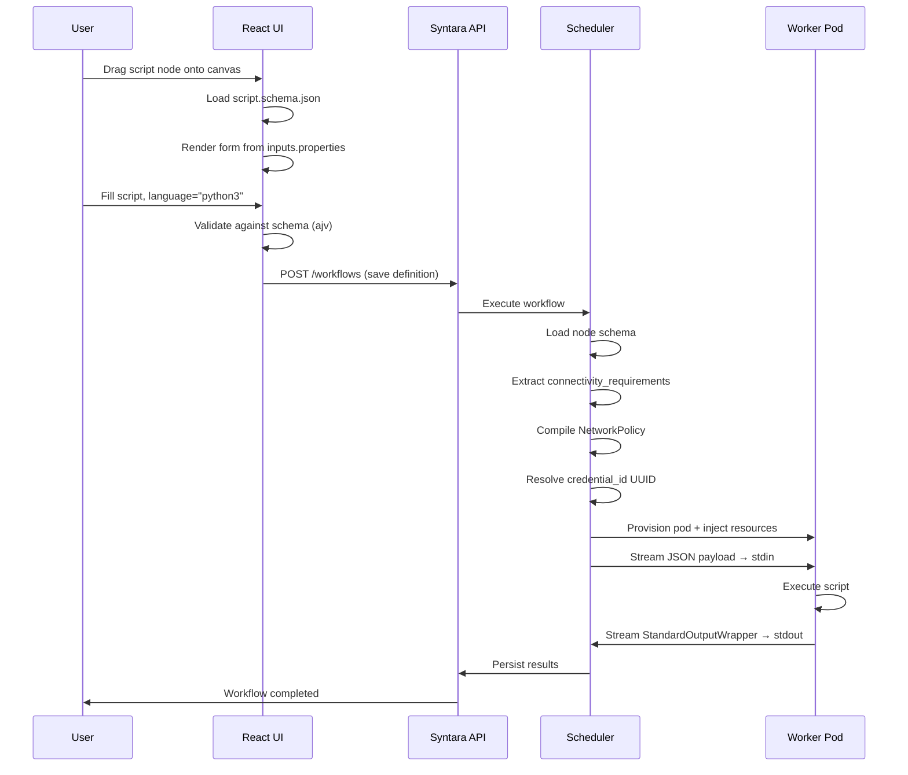
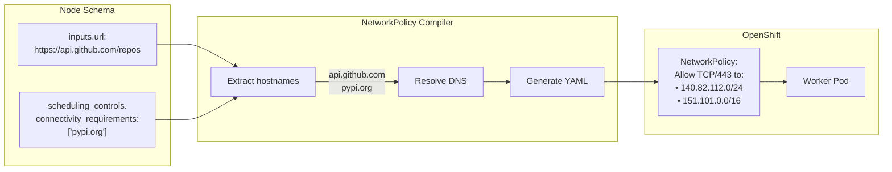

# Node SDK Architecture

Schema-driven execution framework for the Syntara Automation Orchestrator. Defines the structure, resource injection model, and execution contracts for custom automation nodes.

## Architecture Principles

1. **Schemas as Single Source of Truth.** All node metadata (inputs, outputs, resources) declared in JSON Schema (Draft-07). Frontend and backend consume the same schemas.

2. **Strict Backwards Compatibility.** `StandardOutputWrapper` (Result, StatusCode, StatusMessage, ErrorMessage) is immutable. Template expressions like `${task.Result.stdout}` never break.

3. **Zero-Trust Resources.** Workflows store only UUID references. Scheduler resolves at runtime, injects via tmpfs or env vars. No raw secrets in definitions.

4. **Language-Agnostic.** JSON payload → stdin, results ← stdout. Works with any runtime.

5. **Manifest-Declared Permissions.** Nodes declare capabilities. Scheduler enforces via NetworkPolicies before execution.

## Schema Structure



**Key Definitions:**

| Definition | Purpose | Schema Property |
|---|---|---|
| **StandardOutputWrapper** | Immutable output contract | `{Result, StatusCode, StatusMessage, ErrorMessage}` |
| **CredentialReference** | UUID-based resource reference | `{credential_id, credential_mount_type}` |
| **ResourceRequirements** | Kubernetes resource limits | `{limits: {cpu, memory}, requests: {cpu, memory}}` |
| **SchedulingControls** | Network egress + affinity | `{connectivity_requirements, affinity_labels}` |

## Resource Injection Flow

Credentials, inventory, projects, and all platform resources follow the same UUID → runtime resolution pattern.



**Flow Steps:**

1. **Workflow Definition** stores `credential_id: "550e8400-..."` (UUID only, no raw data)
2. **Deployment Validation** checks UUID exists and user has RBAC access
3. **Runtime Resolution** scheduler calls credential service, decrypts from vault
4. **Injection Strategy** based on `credential_mount_type`:
   - `env`: Create K8s Secret → mount as environment variables
   - `file`: Create K8s Secret → mount as tmpfs volume (RAM-backed)
5. **Worker Execution** script accesses via `os.environ['API_KEY']` or `open('/run/secrets/ssh-key')`
6. **Cleanup** K8s deletes Secret on pod exit

**Security Properties:**
- ✅ Workflows are auditable (UUIDs in Git, not secrets)
- ✅ Credentials can be rotated without updating workflows
- ✅ RBAC enforced at resolution time
- ✅ Secrets never appear in logs
- ✅ tmpfs mounts are RAM-only (never persisted to disk)

## Schema → Execution Flow



**Key Integration Points:**

| Component | Schema Usage | Action |
|---|---|---|
| **React Frontend** | Parse `inputs.properties` | Render PatternFly forms (<500ms) |
| **Client Validator** | Validate against `required`, `pattern`, `enum` | Inline validation (<50ms/keystroke) |
| **Backend API** | Store workflow definition | Persist to PostgreSQL |
| **Scheduler** | Extract `connectivity_requirements` | Compile OpenShift NetworkPolicy |
| **Scheduler** | Extract `resource_requirements` | Map to Kubernetes resources spec |
| **Scheduler** | Resolve `credential_id` | Decrypt from vault, create K8s Secret |
| **Worker Pod** | Receive JSON via stdin | Deserialize, execute, return `StandardOutputWrapper` |

## Network Policy Compilation

The scheduler dynamically compiles OpenShift NetworkPolicies from schema declarations.



**Example:**

**Schema declares:**
```json
{
  "inputs": {
    "url": "https://api.github.com/repos/owner/repo"
  },
  "metadata": {
    "scheduling_controls": {
      "connectivity_requirements": ["pypi.org"]
    }
  }
}
```

**Scheduler compiles:**
```yaml
apiVersion: networking.k8s.io/v1
kind: NetworkPolicy
spec:
  podSelector:
    matchLabels:
      task-id: "12345"
  policyTypes: [Egress]
  egress:
    - to:
        - ipBlock: {cidr: 140.82.112.0/24}  # api.github.com
      ports: [{protocol: TCP, port: 443}]
    - to:
        - ipBlock: {cidr: 151.101.0.0/16}   # pypi.org
      ports: [{protocol: TCP, port: 443}]
```

**Result:**
- ✅ `curl https://api.github.com` → Success
- ✅ `pip install requests` → Success (downloads from pypi.org)
- ❌ `curl https://malicious.com` → Timeout (blocked)

## Extending to New Resource Types

The UUID-reference pattern is universal. For inventory, projects, or custom resources:

**Add to `common-definitions.json`:**
```json
{
  "InventoryReference": {
    "type": "object",
    "properties": {
      "inventory_id": {"type": "string", "format": "uuid"},
      "inventory_mount_type": {"enum": ["file", "env"]},
      "inventory_format": {"enum": ["ini", "yaml", "json"]}
    },
    "required": ["inventory_id"]
  }
}
```

**Use in node schemas:**
```json
{
  "nodeType": "ansible_playbook",
  "inputs": {...},
  "resources": {
    "credentials": {"$ref": "#/definitions/CredentialReference"},
    "inventory": {"$ref": "#/definitions/InventoryReference"}
  }
}
```

**Scheduler follows same pattern:**
1. Validate `inventory_id` exists
2. Resolve from inventory service
3. Serialize as YAML/INI/JSON
4. Mount as tmpfs file at `/workspace/inventory.yaml`

## Component Mapping

| Component | Location | Purpose |
|---|---|---|
| **JSON Schemas** | `syntara/schemas/*.json` | Define node contracts (inputs, outputs, metadata) |
| **Schema Loader** | React component | Fetch and parse schemas (<100ms) |
| **Form Renderer** | React component | Map schemas to PatternFly forms (<500ms) |
| **Workflow API** | FastAPI router | Persist definitions to PostgreSQL |
| **NetworkPolicy Compiler** | Scheduler library | Extract `connectivity_requirements` → YAML |
| **Credential Resolver** | Scheduler library | Resolve `credential_id` → decrypt from vault |
| **Worker Provisioner** | Scheduler library | Create K8s Pod + inject resources |

---

**Last Updated:** 2026-09-08  
**Schema Version:** 1.0.0  
**Platform Compatibility:** Syntara >=3.0.0
