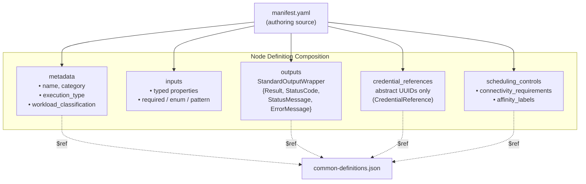
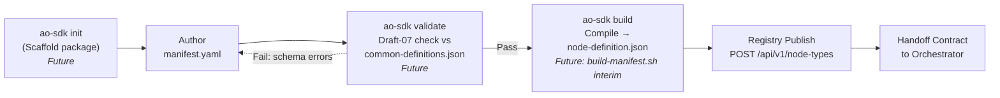
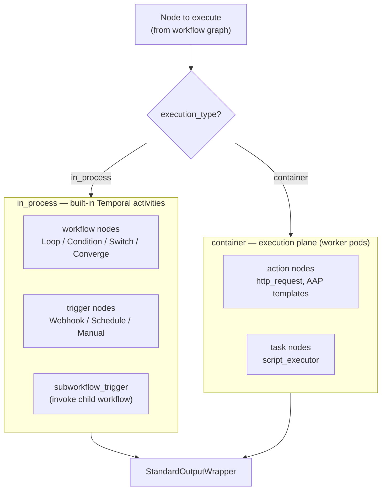
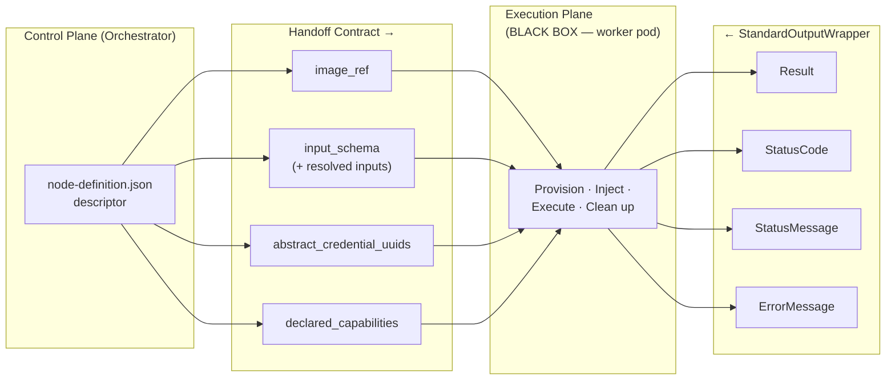
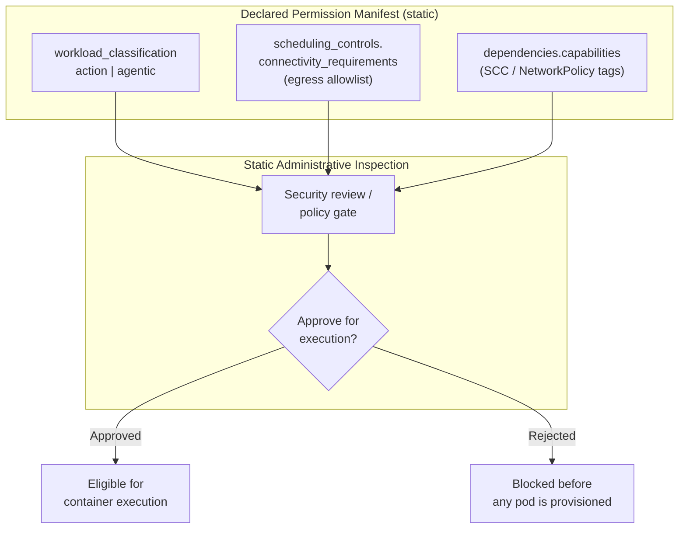

# Node SDK Architecture

Target-state specification for the Syntara Node SDK: the schema-driven framework that defines how custom automation nodes are authored, packaged, registered, and handed off to the execution plane. This document is the authoritative reference for the node taxonomy, the authoring and compilation format, the registry database and API, and the dynamic dispatch contract.

The specification deliberately **shifts left**: it centers on the *definition* of a node — what a node declares about itself — and treats the execution plane as a black box that consumes a well-defined handoff contract. Execution mechanics (pod provisioning, streaming, cleanup) are described only to the extent needed to define the contract.

## Architecture Principles

1. **YAML Authoring, JSON Registry.** Developers author `manifest.yaml` (human-friendly, supports comments). The SDK validates against JSON Schema (Draft-07) and compiles to `node-definition.json` for registry storage. The compiled artifact is the single source of truth the frontend and backend consume, enabling <500ms canvas form rendering.

2. **Four-Category Taxonomy.** Every node declares exactly one of four categories: `action`, `task`, `workflow`, `trigger`. Category, together with `execution_type`, determines routing and validation.

3. **Explicit Execution Plane.** Every node declares an `execution_type` of `in_process` or `container`. This value is the fork point for dynamic dispatch — it decides whether the node runs as a built-in Temporal activity or is handed off to an isolated worker pod.

4. **Strict Backwards Compatibility.** `StandardOutputWrapper` (`Result`, `StatusCode`, `StatusMessage`, `ErrorMessage`) is immutable. Template expressions like `${task.Result.stdout}` never break across node versions.

5. **Zero-Trust Resources.** Node definitions store only UUID references (`abstract_credential_uuids`). The orchestrator resolves them at runtime and injects via tmpfs or env vars. No raw secrets ever appear in a definition.

6. **Manifest-Declared Permissions.** Nodes declare their capabilities and connectivity in the manifest. Administrators can statically inspect and audit these `declared_capabilities` before any container executes.

## Core Architectural Standards & Taxonomy

### Node Category Taxonomy

The platform recognizes exactly four categories, defined canonically as `NodeCategory` in `common-definitions.json`:

```json
"enum": ["action", "task", "workflow", "trigger"]
```

| Category | Purpose | Typical `execution_type` | Examples |
|----------|---------|--------------------------|----------|
| `action` | Domain and external API integrations | `container` | `http_request`, AAP Job Templates |
| `task` | Atomic compute and script executors | `container` | `script_executor` (Python 3.12, Bash 5.2) |
| `workflow` | In-memory control-plane logic | `in_process` | Loop, Condition, Switch, Converge |
| `trigger` | Event entry points | `in_process` | Webhook, Schedule, Manual, `subworkflow_trigger` |

### Execution Type

`NodeExecutionType` (`common-definitions.json`) captures *where* a node runs:

```json
"enum": ["in_process", "container"]
```

- **`in_process`** — executed inline as a built-in Temporal activity inside the orchestrator process. Reserved for control-plane `workflow` logic and `trigger` nodes that need no isolated runtime.
- **`container`** — dispatched to an isolated worker pod (the execution plane). Reserved for `action` and `task` nodes that run user or integration code under strict resource and network isolation.

### The `subworkflow_trigger` Node

`subworkflow_trigger` is a dedicated, first-class node type that lets a parent workflow invoke a child workflow as a composable, reusable unit.

- **Category:** `trigger`
- **Execution type:** `in_process`
- **Reference implementation:** [examples/subworkflow-trigger/](examples/subworkflow-trigger/)

It runs in-process as a built-in Temporal activity: it accepts the **parent workflow context**, an **ingress payload schema** (the parent↔child contract), and the **caller execution ID**, then hands control to the referenced child workflow. It returns a `StandardOutputWrapper` whose `Result` carries the child workflow's terminal output, so downstream parent nodes can reference it via stable template expressions (e.g., `${call_child.Result.summary}`). The orchestrator tracks invocation `depth` to bound recursion.

### `manifest.yaml` — The Developer Authoring Format

Developers author a single `manifest.yaml`. It is:

- **Human-friendly** — supports comments and multi-line strings.
- **Validated** — checked against JSON Schema (Draft-07) referencing `common-definitions.json`.
- **Compiled** — `ao-sdk build` produces `node-definition.json`, the artifact stored in the registry and served to the canvas.

The compiled `node-definition.json` — not the source `manifest.yaml` — is what the registry persists and what the React canvas loads to render input forms in under 500ms.

**Standard Package Layout:**
```
my-custom-node/
├── manifest.yaml              # Primary authoring manifest (YAML, source of truth for authoring)
├── main.py                    # Imperative execution code (or main.sh for Bash)
├── requirements.txt           # Python dependencies (optional)
├── README.md                  # Node documentation
└── tests/
    └── test_main.py           # Unit tests
```

### Diagram 1 — Node Definition Composition (`manifest.yaml`)

Structural breakdown of what a `manifest.yaml` composes. This is the "what" of a node — its declared shape, independent of how it runs.



### Diagram 2 — SDK Authoring & Packaging Lifecycle

The developer lifecycle from scaffold to registry handoff. Every stage operates on the *definition*; the orchestrator only appears at the end, receiving a contract.

**Note:** `ao-sdk` CLI is a future tool. Current workflow uses `build-manifest.sh` for YAML → JSON compilation.



## Database Schema & Registry API

The registry persists compiled node definitions in PostgreSQL and exposes them through a versioned REST API.

### `node_types` Table (DDL)

```sql
CREATE TABLE node_types (
    id             UUID PRIMARY KEY DEFAULT gen_random_uuid(),
    name           TEXT NOT NULL,
    category       TEXT NOT NULL
                     CHECK (category IN ('action', 'task', 'workflow', 'trigger')),
    execution_type TEXT NOT NULL
                     CHECK (execution_type IN ('in_process', 'container')),
    descriptor     JSONB NOT NULL,          -- compiled node-definition.json
    image_ref      TEXT,                     -- container image (NULL for in_process nodes)
    version        TEXT NOT NULL DEFAULT '1.0.0',
    enabled        BOOLEAN NOT NULL DEFAULT TRUE,
    created_at     TIMESTAMPTZ NOT NULL DEFAULT now(),
    updated_at     TIMESTAMPTZ NOT NULL DEFAULT now(),
    UNIQUE (name, version)
);

-- Container-backed nodes must declare an image; in_process nodes must not.
ALTER TABLE node_types ADD CONSTRAINT node_types_image_ref_by_execution_type
    CHECK (
        (execution_type = 'container'  AND image_ref IS NOT NULL) OR
        (execution_type = 'in_process' AND image_ref IS NULL)
    );

-- GIN index for querying declared capabilities / connectivity inside the descriptor.
CREATE INDEX idx_node_types_descriptor ON node_types USING GIN (descriptor);
CREATE INDEX idx_node_types_category   ON node_types (category);
CREATE INDEX idx_node_types_enabled    ON node_types (enabled);
```

### `NodeTypeDescriptor` (SQLModel / Pydantic)

Per project standards, a single SQLModel class serves as both the database table and the API schema.

```python
from datetime import datetime
from enum import StrEnum
from typing import Any
from uuid import UUID, uuid4

from sqlalchemy import CheckConstraint, UniqueConstraint
from sqlalchemy.dialects.postgresql import JSONB
from sqlmodel import Column, Field, SQLModel


class NodeCategory(StrEnum):
    ACTION = "action"
    TASK = "task"
    WORKFLOW = "workflow"
    TRIGGER = "trigger"


class NodeExecutionType(StrEnum):
    IN_PROCESS = "in_process"
    CONTAINER = "container"


class NodeTypeDescriptor(SQLModel, table=True):
    """Registry record for a single compiled node definition.

    `descriptor` holds the compiled node-definition.json produced by
    `ao-sdk build`; it is the contract the orchestrator hands to the
    execution plane. `image_ref` is required for container nodes and
    forbidden for in_process nodes (enforced by a table CHECK constraint).
    """

    __tablename__ = "node_types"
    __table_args__ = (
        UniqueConstraint("name", "version", name="uq_node_types_name_version"),
        CheckConstraint(
            "(execution_type = 'container' AND image_ref IS NOT NULL) OR "
            "(execution_type = 'in_process' AND image_ref IS NULL)",
            name="node_types_image_ref_by_execution_type",
        ),
    )

    id: UUID = Field(default_factory=uuid4, primary_key=True)
    name: str = Field(index=True)
    category: NodeCategory = Field(index=True)
    execution_type: NodeExecutionType
    descriptor: dict[str, Any] = Field(sa_column=Column(JSONB, nullable=False))
    image_ref: str | None = Field(default=None)
    version: str = Field(default="1.0.0")
    enabled: bool = Field(default=True, index=True)
    created_at: datetime = Field(default_factory=datetime.utcnow)
    updated_at: datetime = Field(default_factory=datetime.utcnow)
```

### Registry REST API — `/api/v1/node-types`

All responses use the platform's standard envelope. Single-resource responses wrap the record; list responses include pagination metadata.

| Method | Path | Purpose |
|--------|------|---------|
| `POST` | `/api/v1/node-types` | Register (publish) a compiled node definition |
| `GET` | `/api/v1/node-types` | List registered node types (filter by `category`, `execution_type`, `enabled`) |
| `GET` | `/api/v1/node-types/{id}` | Fetch a single node type descriptor |
| `PATCH` | `/api/v1/node-types/{id}` | Update mutable fields (`enabled`, `image_ref`, `descriptor` for a new version) |
| `DELETE` | `/api/v1/node-types/{id}` | Remove a node type from the registry |

**`POST /api/v1/node-types`** — request body is the compiled `node-definition.json` plus registry metadata:

```json
{
  "name": "script_executor",
  "category": "task",
  "execution_type": "container",
  "image_ref": "registry.syntara.io/nodes/script-executor:1.0.0",
  "version": "1.0.0",
  "descriptor": { "...": "compiled node-definition.json" }
}
```

Response `201 Created`:

```json
{
  "data": {
    "id": "550e8400-e29b-41d4-a716-446655440000",
    "name": "script_executor",
    "category": "task",
    "execution_type": "container",
    "image_ref": "registry.syntara.io/nodes/script-executor:1.0.0",
    "version": "1.0.0",
    "enabled": true,
    "descriptor": { "...": "compiled node-definition.json" },
    "created_at": "2026-09-09T12:00:00Z",
    "updated_at": "2026-09-09T12:00:00Z"
  }
}
```

**`GET /api/v1/node-types?category=task&enabled=true`** — list envelope:

```json
{
  "data": [
    { "id": "550e8400-...", "name": "script_executor", "category": "task", "execution_type": "container", "enabled": true }
  ],
  "meta": { "total": 1, "limit": 50, "offset": 0 }
}
```

**`PATCH /api/v1/node-types/{id}`** — partial update; returns the updated record in the `data` envelope:

```json
{ "enabled": false }
```

**`DELETE /api/v1/node-types/{id}`** — returns `204 No Content` on success, `404` if the id is unknown.

## Dynamic Dispatch Logic (`dynamic_workflow.py`)

The orchestrator's workflow engine forks execution on a node's `execution_type`. This fork is the boundary between the control plane and the execution plane.



- **`in_process` branch** — the engine dispatches the node as a built-in Temporal activity within the orchestrator process. This path serves control-plane `workflow` logic and `trigger` nodes, including `subworkflow_trigger`, which starts a child workflow and awaits its terminal output.
- **`container` branch** — the engine resolves credentials and connectivity, then hands the node's descriptor to the execution plane, which provisions an isolated worker pod. This path serves `action` and `task` nodes.

Both branches return the identical `StandardOutputWrapper` envelope, so downstream nodes are agnostic to where a node ran.

### Diagram 3 — Execution Plane Handoff Contract

The exact contract the control plane hands to the execution plane for a `container` node, and the envelope that returns. The execution plane details are intentionally ignored: this diagram fixes only the inputs and outputs at its boundary.



### Diagram 4 — Declared Capabilities & Permission Manifest

Static administrative inspection. Before any container runs, an administrator (or an automated policy gate) can audit exactly what a node is permitted to do, purely from its declared manifest.



Key inspection points, all resolvable without executing the node:

- **`workload_classification`** (`action` | `agentic`) — gates which credential classes the node may access; `agentic` nodes are blocked from infrastructure credentials.
- **`connectivity_requirements`** — the declared egress allowlist, from which the orchestrator compiles a restrictive NetworkPolicy.
- **`declared_capabilities`** — SCC / NetworkPolicy tags (e.g., `network-egress`, `script-execution`) validated against cluster policy.

## Schema Reference

### Platform Meta-Schema

The schema files under `syntara/schemas/` implement the standards above. The platform maintains a **single meta-schema** that defines shared types, enums, and validation rules:

| File | Role |
|------|------|
| `common-definitions.json` | **Sole platform meta-schema** — defines `NodeCategory`, `NodeExecutionType`, `WorkloadClassification`, `StandardOutputWrapper`, `CredentialReference`, `ResourceRequirements`, `SchedulingControls`, and `DependencyDeclaration` |

Individual node schemas are **not** maintained as separate `.schema.json` files. Instead:

1. **Developers author** `manifest.yaml` instances (e.g., `script_executor/manifest.yaml`, `http_request/manifest.yaml`, `subworkflow_trigger/manifest.yaml`)
2. **The SDK compiles** each manifest into a `node-definition.json` build artifact via `ao-sdk build`
3. **The registry persists** the compiled `node-definition.json` in the `node_types.descriptor` JSONB column
4. **The orchestrator and canvas consume** the compiled artifact, not the source manifest

`common-definitions.json` is the authoritative source for shared platform types. All `manifest.yaml` instances reference these definitions via `$ref` during validation; after compilation, the resulting `node-definition.json` inherits these constraints.

### Key Common Definitions

| Definition | Purpose | Shape |
|---|---|---|
| `NodeCategory` | Four-category taxonomy | `enum: ["action", "task", "workflow", "trigger"]` |
| `NodeExecutionType` | Execution plane fork | `enum: ["in_process", "container"]` |
| `WorkloadClassification` | Credential access control | `enum: ["action", "agentic"]` |
| `StandardOutputWrapper` | Immutable output contract | `{Result, StatusCode, StatusMessage, ErrorMessage}` |
| `CredentialReference` | UUID-based credential reference | `{credential_id, credential_mount_type, credential_mount_path}` |
| `ResourceRequirements` | Kubernetes resource limits | `{limits: {cpu, memory}, requests: {cpu, memory}}` |
| `SchedulingControls` | Egress allowlist + affinity | `{connectivity_requirements, affinity_labels}` |
| `DependencyDeclaration` | Version + capability constraints | `{platformVersion, capabilities, collections, extensions}` |

### Compiled Definition Shape

Every compiled `node-definition.json` declares, at minimum:

```json
{
  "nodeType": "script_executor",
  "category": "task",
  "execution_type": "container",
  "inputs": { "...": "typed properties" },
  "outputs": { "$ref": "common-definitions.json#/definitions/StandardOutputWrapper" }
}
```

`nodeType`, `category`, `execution_type`, `inputs`, and `outputs` are required on all compiled node definitions. The `category` and `execution_type` pairing determines node behavior:
- **`script_executor`** manifest declares `category: task` + `execution_type: container`
- **`http_request`** manifest declares `category: action` + `execution_type: container`  
- **`subworkflow_trigger`** manifest declares `category: trigger` + `execution_type: in_process`

These pairings are validated during `ao-sdk validate` and enforced by the registry's table constraints.
